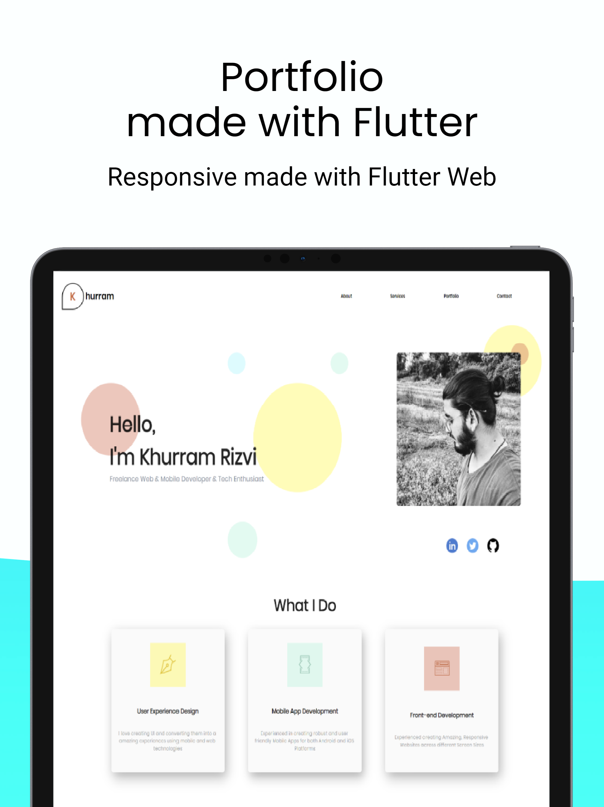
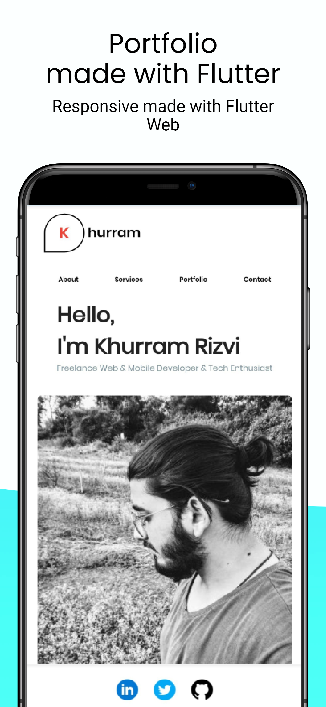
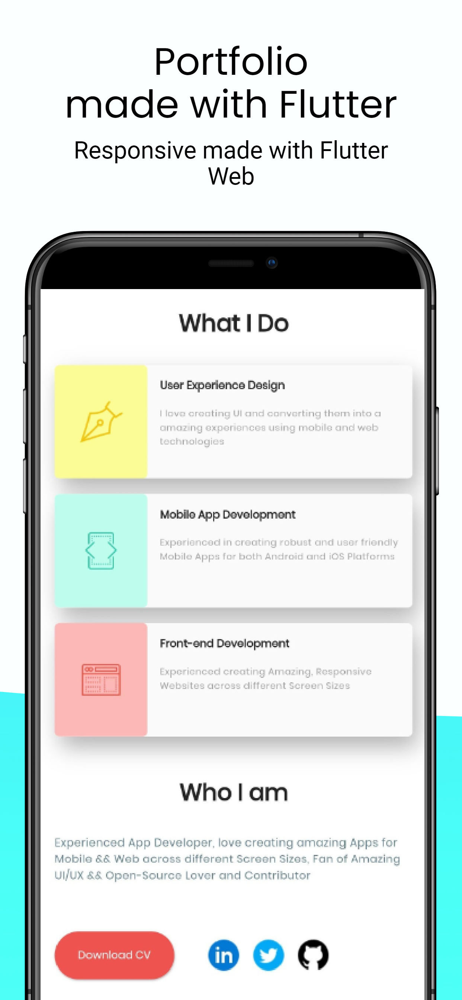

# Portfolio 

A new Portfolio Website made using Flutter for Web.
* Implemented using flutter framework 💜
* Performance optimization done ⚡
* Built with Flutter 2.0, adaptive to on any device viewport 👀
* Dark Mode Supported 🌓

[](https://app.netlify.com/sites/khurramrizvi/deploys)   &nbsp; [](https://opensource.org/licenses/MIT)

### Live Preview at: <a href='https://khurramrizvi.netlify.app'>khurramrizvi.netlify.app</a>


## Screenshot
<table>
   <tr>
      <td></td>
      <td></td>
      <td></td>
   </tr>
 </table>

 
 ## How to make it yours? 

### Step 1: Clone this project
### Step 2: Head over to <a href='https://github.com/khurramrizvi/Portfolio/blob/main/lib/utilities/strings.dart'>strings.dart</a> file under ```Portfolio/lib/utilities/strings.dart ```
### Step 3: Edit the values of variables in strings.dart file.

``` dart
strings.dart

//website title
final String kTitle = 'Khurram Rizvi | Portfolio';

//final strings used in Navbar
final String kAbout = 'About';
final String kServices = 'Services';
final String kPortfolio = 'Portfolio';
final String kContact = "Contact";

//final Strings used for about page
final String kHello = 'Hello,';
final String kName = "I'm Khurram Rizvi";
final String kDescription =
    'Freelance Web & Mobile Developer & Tech Enthusiast';
final String kProfileImageURL =
    'https://avatars2.githubusercontent.com/u/29674485?s=460&u=bb124332a205ec974d682e384facc441b9fb07ac&v=4';

//final Strings for services page
final String kWhatIdo = 'What I Do';
final String kCard1title = 'User Experience Design';
final String kCard2title = 'Mobile App Development';
final String kCard3title = 'Front-end Development';
final String kWhoIam = 'Who I Am';
final String kWhoIamDetails =
    'Experienced App Developer, love creating amazing Apps for Mobile && Web across different Screen Sizes, Fan of Amazing UI/UX && Open-Source Lover and Contributor';

final String kCard1Descrption =
    'I love creating UI and converting them into a amazing experiences using mobile and web technologies';
final String kCard2Descrption =
    'Experienced in creating robust and user friendly Mobile Apps for both Android and iOS Platforms';
final String kCard3Descrption =
    'Experienced creating Amazing, Responsive Websites across different Screen Sizes';

final String kDownloadCV = 'Download CV';
final String kCvUrl =
    'https://drive.google.com/file/d/1XgIK5AQOJJ1wQpd_QNSLv0R-G1M1GW3D/view?usp=sharing';

//final Strings for portfolio page
final String kMySelectedWork = 'My Selected Work';
final String kViewAllWork = 'View All Work';
final String kViewAllWorkLink =
    'https://github.com/khurramrizvi'; //set up any url to demonstrate all your work, I am setting my github url

final String kWorkImageUrl1 = 'lib/images/calender.png';
final String kWorkImageUrl2 = 'lib/images/crypto.png';
final String kWorkImageUrl3 = 'lib/images/chat.png';
final String kWorkImageUrl4 = 'lib/images/blog.png';

//final String for Contact Page
final String kContactCardTitle = 'Have Any Project in Mind? Say Hello At';
final String kEmail = 'khurramrizvi72@gmail.com';

//final Strings for Website Icon
final String kIconFirstLetter =
    '  K  '; //maintain the space as in this string to obtain a circular shape of Icon
final String kIconRemainingLetters =
    ' hurram'; //add remaining letters here, follow the spacing as in String at start

//final Strings for Footer present in contact_page.dart
final String kRightsReserved = '© Khurram 2021. All rights reserved.';

//final String social Links used under icon_widgets.dart
final String kLinkedInURL = 'https://www.linkedin.com/in/khurramrizvi/';
final String kTwitterURL = 'https://twitter.com/khurram_rizvi72';
final String kGithubURL = 'https://github.com/khurramrizvi';
```

### Step 4: Build the project with default Renderer (uses Canvas Kit on Desktop and Html Renderer on Mobile) [Preferred]

 ``` dart
 flutter build web
 ```
 
### OR

### Step 4: Building the project using HTML Renderer (Optimized build for Mobile, but also uses the same rendering on Desktop)
``` dart
 flutter run --release --web-renderer html
```
### Step 5: Deploying the Web Build
* You can now simply copy the <b>web folder</b> under the <b>build folder</b> and host it to your Preferred Hosting.
* List of Free Hosting
   * <a href='https://github.com'>Github</a>
   * <a href = 'https://firebase.google.com/products/hosting'>Firebase</a>
   * <a href = 'https://www.netlify.com/'>Netlify</a>
   
 ### Step 6: Enjoy 😉
 
## If you like my work and want to show some ❤️, please consider giving a ⭐️ to this Repository.

## Support me
<a href="https://www.buymeacoffee.com/khurramrizvi" target="_blank"></a>


 
